# Especificación API - Webhook MercadoPago (Backend NestJS)

## 📋 Tabla de Contenidos

1. [Resumen](#resumen)
2. [Flujo Completo](#flujo-completo)
3. [Arquitectura](#arquitectura)
4. [Endpoints Requeridos](#endpoints-requeridos)
5. [Modelos de Datos](#modelos-de-datos)
6. [Implementación NestJS](#implementación-nestjs)
7. [Seguridad](#seguridad)
8. [Testing](#testing)
9. [Troubleshooting](#troubleshooting)

---

## 📋 Resumen

### Objetivo
Procesar pagos de MercadoPago y asignar automáticamente `video_category` (cursos) a usuarios cuando el pago es aprobado.

### Flujo Simplificado
```
Usuario paga → MercadoPago webhook → Frontend recibe → Backend procesa → Asigna curso al usuario
```

---

## 🔄 Flujo Completo

### 1. **Usuario Completa Pago**
```
Usuario en checkout → MercadoPago → Pago exitoso
```

### 2. **MercadoPago Notifica**
```
MercadoPago envía webhook POST → Frontend (/api/webhook)
```

**Payload de MercadoPago:**
```json
{
  "type": "payment",
  "data": {
    "id": "1234567890"
  }
}
```

### 3. **Frontend Procesa y Reenvía**
```typescript
// frontend-web-mery/app/api/webhook/route.ts

// 1. Recibe notificación de MercadoPago
const body = await request.json();

// 2. Consulta detalles del pago
const payment = await new Payment(client).get({ id: paymentId });

// 3. Si el pago está aprobado, reenvía al backend
if (payment.status === 'approved') {
  await fetch(`${BACKEND_URL}/purchases/mercadopago-webhook`, {
    method: 'POST',
    body: JSON.stringify({
      paymentId: payment.id,
      userEmail: payment.metadata?.user_email,
      items: payment.additional_info?.items,
      amount: payment.transaction_amount,
      currency: payment.currency_id,
      status: payment.status,
      transactionId: payment.id?.toString(),
      paymentMethod: payment.payment_method_id,
      payerEmail: payment.payer?.email,
    })
  });
}
```

### 4. **Backend Procesa**
```
Backend recibe → Valida → Crea Purchase → Asigna CategoryPurchase → Usuario obtiene acceso
```

---

## 🏗️ Arquitectura

### Base de Datos (Prisma Schema Reference)

```prisma
model User {
  id                String              @id @default(uuid())
  email             String              @unique
  firstName         String?
  lastName          String?
  phone             String?
  country           String?
  city              String?
  role              UserRole            @default(USER)
  isActive          Boolean             @default(true)
  purchases         Purchase[]
  categoryPurchases CategoryPurchase[]
  createdAt         DateTime            @default(now())
  updatedAt         DateTime            @updatedAt
}

model VideoCategory {
  id                String              @id @default(uuid())
  name              String
  description       String?
  priceARS          Float
  priceUSD          Float
  currency          Currency            @default(ARS)
  categoryPurchases CategoryPurchase[]
  videos            Video[]
  createdAt         DateTime            @default(now())
  updatedAt         DateTime            @updatedAt
}

model Purchase {
  id                String              @id @default(uuid())
  userId            String
  user              User                @relation(fields: [userId], references: [id])
  totalAmount       Float
  currency          String
  status            PurchaseStatus      @default(PENDING)
  paymentMethod     String?
  transactionId     String?             @unique
  paymentId         String?             @unique
  categoryPurchases CategoryPurchase[]
  createdAt         DateTime            @default(now())
  updatedAt         DateTime            @updatedAt
}

model CategoryPurchase {
  id              String         @id @default(uuid())
  userId          String
  user            User           @relation(fields: [userId], references: [id])
  categoryId      String
  category        VideoCategory  @relation(fields: [categoryId], references: [id])
  purchaseId      String?
  purchase        Purchase?      @relation(fields: [purchaseId], references: [id])
  priceAtPurchase Float
  currency        String
  status          PurchaseStatus @default(COMPLETED)
  expiresAt       DateTime?
  createdAt       DateTime       @default(now())
  updatedAt       DateTime       @updatedAt

  @@unique([userId, categoryId])
  @@index([userId])
  @@index([categoryId])
}

enum PurchaseStatus {
  PENDING
  COMPLETED
  FAILED
  REFUNDED
}

enum Currency {
  ARS
  USD
}

enum UserRole {
  USER
  SUBADMIN
  ADMIN
}
```

---

## 🔌 Endpoints Requeridos

### 1. **Webhook Endpoint** ⭐ (PRINCIPAL)

```http
POST /api/purchases/mercadopago-webhook
Content-Type: application/json
```

**Request Body:**
```typescript
interface MercadoPagoWebhookPayload {
  paymentId: number | string;
  userEmail: string;
  items: Array<{
    id: string;
    title: string;
    description?: string;
    quantity: number;
    unit_price: number;
    currency_id: string;
  }>;
  amount: number;
  currency: string;
  status: string;
  transactionId: string;
  paymentMethod?: string;
  payerEmail?: string;
}
```

**Response (Success):**
```json
{
  "success": true,
  "message": "Purchase processed successfully",
  "data": {
    "purchaseId": "uuid",
    "userId": "uuid",
    "categoriesGranted": ["category-id-1", "category-id-2"],
    "totalAmount": 5000,
    "currency": "ARS"
  }
}
```

**Response (Error):**
```json
{
  "success": false,
  "error": "User not found",
  "details": "No user found with email: test@example.com"
}
```

### 2. **Verificar Acceso de Usuario** (Opcional pero recomendado)

```http
GET /api/users/:userId/categories/:categoryId/access
Authorization: Bearer <token>
```

**Response:**
```json
{
  "hasAccess": true,
  "purchaseDate": "2025-10-17T10:30:00Z",
  "expiresAt": null
}
```

### 3. **Listar Compras de Usuario** (Opcional)

```http
GET /api/users/:userId/purchases
Authorization: Bearer <token>
```

**Response:**
```json
{
  "purchases": [
    {
      "id": "uuid",
      "totalAmount": 5000,
      "currency": "ARS",
      "status": "COMPLETED",
      "paymentMethod": "credit_card",
      "categories": [
        {
          "id": "category-id",
          "name": "Curso de Nanoblading",
          "priceAtPurchase": 5000
        }
      ],
      "createdAt": "2025-10-17T10:30:00Z"
    }
  ]
}
```

---

## 🛠️ Implementación NestJS

### Estructura de Archivos

```
src/
├── purchases/
│   ├── purchases.module.ts
│   ├── purchases.controller.ts
│   ├── purchases.service.ts
│   └── dto/
│       ├── mercadopago-webhook.dto.ts
│       └── create-purchase.dto.ts
├── category-purchases/
│   ├── category-purchases.module.ts
│   ├── category-purchases.service.ts
│   └── dto/
│       └── grant-category-access.dto.ts
└── users/
    └── users.service.ts (ya existe)
```

### 1. **DTO - MercadoPago Webhook**

**`src/purchases/dto/mercadopago-webhook.dto.ts`**
```typescript
import { IsString, IsNumber, IsEmail, IsArray, IsOptional, ValidateNested } from 'class-validator';
import { Type } from 'class-transformer';

class MercadoPagoItemDto {
  @IsString()
  id: string;

  @IsString()
  title: string;

  @IsString()
  @IsOptional()
  description?: string;

  @IsNumber()
  quantity: number;

  @IsNumber()
  unit_price: number;

  @IsString()
  currency_id: string;
}

export class MercadoPagoWebhookDto {
  @IsString()
  paymentId: string;

  @IsEmail()
  userEmail: string;

  @IsArray()
  @ValidateNested({ each: true })
  @Type(() => MercadoPagoItemDto)
  items: MercadoPagoItemDto[];

  @IsNumber()
  amount: number;

  @IsString()
  currency: string;

  @IsString()
  status: string;

  @IsString()
  transactionId: string;

  @IsString()
  @IsOptional()
  paymentMethod?: string;

  @IsEmail()
  @IsOptional()
  payerEmail?: string;
}
```

### 2. **Controller**

**`src/purchases/purchases.controller.ts`**
```typescript
import {
  Controller,
  Post,
  Body,
  HttpCode,
  HttpStatus,
  Logger,
  HttpException,
} from '@nestjs/common';
import { PurchasesService } from './purchases.service';
import { MercadoPagoWebhookDto } from './dto/mercadopago-webhook.dto';

@Controller('purchases')
export class PurchasesController {
  private readonly logger = new Logger(PurchasesController.name);

  constructor(private readonly purchasesService: PurchasesService) {}

  @Post('mercadopago-webhook')
  @HttpCode(HttpStatus.OK)
  async handleMercadoPagoWebhook(@Body() payload: MercadoPagoWebhookDto) {
    this.logger.log('========== MercadoPago Webhook Received ==========');
    this.logger.log(`Payment ID: ${payload.paymentId}`);
    this.logger.log(`User Email: ${payload.userEmail}`);
    this.logger.log(`Amount: ${payload.amount} ${payload.currency}`);
    this.logger.log(`Status: ${payload.status}`);

    try {
      // Validar que el pago esté aprobado
      if (payload.status !== 'approved') {
        this.logger.warn(`Payment not approved. Status: ${payload.status}`);
        return {
          success: false,
          message: 'Payment not approved',
          status: payload.status,
        };
      }

      // Procesar la compra
      const result = await this.purchasesService.processMercadoPagoPayment(payload);

      this.logger.log('✅ Purchase processed successfully');
      this.logger.log(`Purchase ID: ${result.purchaseId}`);
      this.logger.log(`Categories granted: ${result.categoriesGranted.join(', ')}`);
      this.logger.log('========== End Webhook Processing ==========');

      return {
        success: true,
        message: 'Purchase processed successfully',
        data: result,
      };
    } catch (error) {
      this.logger.error('❌ Error processing webhook:', error.message);
      this.logger.error(error.stack);
      this.logger.log('========== End Webhook Processing (Error) ==========');

      // No lanzar error para evitar que MercadoPago reintente
      return {
        success: false,
        error: error.message,
        details: error.stack,
      };
    }
  }
}
```

### 3. **Service** ⭐ (LÓGICA PRINCIPAL)

**`src/purchases/purchases.service.ts`**
```typescript
import { Injectable, Logger, NotFoundException, BadRequestException } from '@nestjs/common';
import { PrismaService } from '../prisma/prisma.service';
import { MercadoPagoWebhookDto } from './dto/mercadopago-webhook.dto';
import { PurchaseStatus } from '@prisma/client';

interface ProcessPaymentResult {
  purchaseId: string;
  userId: string;
  categoriesGranted: string[];
  totalAmount: number;
  currency: string;
}

@Injectable()
export class PurchasesService {
  private readonly logger = new Logger(PurchasesService.name);

  constructor(private readonly prisma: PrismaService) {}

  async processMercadoPagoPayment(
    payload: MercadoPagoWebhookDto,
  ): Promise<ProcessPaymentResult> {
    this.logger.log(`[ProcessPayment] Starting for user: ${payload.userEmail}`);

    // 1. Verificar si ya existe una compra con este transactionId (idempotencia)
    const existingPurchase = await this.prisma.purchase.findUnique({
      where: { transactionId: payload.transactionId },
      include: {
        categoryPurchases: true,
      },
    });

    if (existingPurchase) {
      this.logger.warn(`[ProcessPayment] Purchase already exists: ${existingPurchase.id}`);
      return {
        purchaseId: existingPurchase.id,
        userId: existingPurchase.userId,
        categoriesGranted: existingPurchase.categoryPurchases.map((cp) => cp.categoryId),
        totalAmount: existingPurchase.totalAmount,
        currency: existingPurchase.currency,
      };
    }

    // 2. Buscar usuario por email
    const user = await this.prisma.user.findUnique({
      where: { email: payload.userEmail },
    });

    if (!user) {
      throw new NotFoundException(`User not found with email: ${payload.userEmail}`);
    }

    this.logger.log(`[ProcessPayment] User found: ${user.id}`);

    // 3. Validar que los items existen
    const categoryIds = payload.items.map((item) => item.id);
    const categories = await this.prisma.videoCategory.findMany({
      where: {
        id: {
          in: categoryIds,
        },
      },
    });

    if (categories.length !== categoryIds.length) {
      throw new BadRequestException(
        `Some categories not found. Expected: ${categoryIds.length}, Found: ${categories.length}`,
      );
    }

    this.logger.log(`[ProcessPayment] All categories found: ${categories.length}`);

    // 4. Usar transacción para crear Purchase y CategoryPurchases
    const result = await this.prisma.$transaction(async (tx) => {
      // 4.1 Crear Purchase
      const purchase = await tx.purchase.create({
        data: {
          userId: user.id,
          totalAmount: payload.amount,
          currency: payload.currency,
          status: PurchaseStatus.COMPLETED,
          paymentMethod: payload.paymentMethod,
          transactionId: payload.transactionId,
          paymentId: payload.paymentId,
        },
      });

      this.logger.log(`[ProcessPayment] Purchase created: ${purchase.id}`);

      // 4.2 Crear CategoryPurchases (asignar cursos al usuario)
      const categoryPurchases = await Promise.all(
        payload.items.map(async (item) => {
          const category = categories.find((cat) => cat.id === item.id);
          
          if (!category) {
            throw new BadRequestException(`Category ${item.id} not found`);
          }

          // Verificar si ya tiene acceso (por si acaso)
          const existingAccess = await tx.categoryPurchase.findUnique({
            where: {
              userId_categoryId: {
                userId: user.id,
                categoryId: category.id,
              },
            },
          });

          if (existingAccess) {
            this.logger.warn(
              `[ProcessPayment] User already has access to category ${category.id}`,
            );
            return existingAccess;
          }

          // Crear acceso
          return tx.categoryPurchase.create({
            data: {
              userId: user.id,
              categoryId: category.id,
              purchaseId: purchase.id,
              priceAtPurchase: item.unit_price,
              currency: item.currency_id,
              status: PurchaseStatus.COMPLETED,
            },
          });
        }),
      );

      this.logger.log(
        `[ProcessPayment] ${categoryPurchases.length} category accesses granted`,
      );

      return {
        purchase,
        categoryPurchases,
      };
    });

    // 5. Retornar resultado
    return {
      purchaseId: result.purchase.id,
      userId: user.id,
      categoriesGranted: result.categoryPurchases.map((cp) => cp.categoryId),
      totalAmount: result.purchase.totalAmount,
      currency: result.purchase.currency,
    };
  }

  // Método auxiliar para verificar acceso
  async checkUserCategoryAccess(userId: string, categoryId: string): Promise<boolean> {
    const access = await this.prisma.categoryPurchase.findUnique({
      where: {
        userId_categoryId: {
          userId,
          categoryId,
        },
      },
    });

    return !!access;
  }

  // Obtener compras de un usuario
  async getUserPurchases(userId: string) {
    return this.prisma.purchase.findMany({
      where: { userId },
      include: {
        categoryPurchases: {
          include: {
            category: true,
          },
        },
      },
      orderBy: {
        createdAt: 'desc',
      },
    });
  }
}
```

### 4. **Module**

**`src/purchases/purchases.module.ts`**
```typescript
import { Module } from '@nestjs/common';
import { PurchasesController } from './purchases.controller';
import { PurchasesService } from './purchases.service';
import { PrismaModule } from '../prisma/prisma.module';

@Module({
  imports: [PrismaModule],
  controllers: [PurchasesController],
  providers: [PurchasesService],
  exports: [PurchasesService],
})
export class PurchasesModule {}
```

### 5. **Agregar al AppModule**

**`src/app.module.ts`**
```typescript
import { Module } from '@nestjs/common';
import { PurchasesModule } from './purchases/purchases.module';
// ... otros imports

@Module({
  imports: [
    // ... otros módulos
    PurchasesModule, // ⭐ Agregar aquí
  ],
  // ...
})
export class AppModule {}
```

---

## 🔒 Seguridad

### 1. **Idempotencia**
```typescript
// Verificar si ya se procesó este pago
const existingPurchase = await this.prisma.purchase.findUnique({
  where: { transactionId: payload.transactionId },
});

if (existingPurchase) {
  return existingPurchase; // Ya procesado
}
```

**Importancia:** MercadoPago puede enviar el mismo webhook múltiples veces. Debes evitar duplicar compras.

### 2. **Validación de Firma** (Opcional pero RECOMENDADO)

MercadoPago envía headers de seguridad:

```typescript
// En el controller, agregar:
@Post('mercadopago-webhook')
async handleMercadoPagoWebhook(
  @Body() payload: MercadoPagoWebhookDto,
  @Headers() headers: Record<string, string>,
) {
  // Validar firma
  const xSignature = headers['x-signature'];
  const xRequestId = headers['x-request-id'];
  
  if (!this.validateMercadoPagoSignature(xSignature, xRequestId, payload)) {
    throw new UnauthorizedException('Invalid signature');
  }
  
  // ... procesar
}

private validateMercadoPagoSignature(
  signature: string,
  requestId: string,
  payload: any,
): boolean {
  // Implementar validación según documentación de MercadoPago
  // https://www.mercadopago.com.ar/developers/es/docs/your-integrations/notifications/webhooks
  
  const secret = process.env.MERCADOPAGO_WEBHOOK_SECRET;
  // ... lógica de validación
  return true; // simplificado
}
```

### 3. **Transacciones de Base de Datos**

```typescript
await this.prisma.$transaction(async (tx) => {
  // Todas las operaciones deben completarse o ninguna
  const purchase = await tx.purchase.create({ /* ... */ });
  const categoryPurchases = await tx.categoryPurchase.createMany({ /* ... */ });
  return { purchase, categoryPurchases };
});
```

**Importancia:** Si falla asignar un curso, se debe revertir toda la compra.

### 4. **Variables de Entorno**

**`.env`**
```env
# MercadoPago
MERCADOPAGO_ACCESS_TOKEN=APP_USR-xxxxxxxxxx
MERCADOPAGO_PUBLIC_KEY=APP_USR-xxxxxxxxxx
MERCADOPAGO_WEBHOOK_SECRET=your_webhook_secret

# Frontend URL (para logs/debugging)
FRONTEND_URL=https://frontend-web-mery-production.up.railway.app

# Database
DATABASE_URL="postgresql://..."
```

---

## 🧪 Testing

### 1. **Unit Tests**

**`src/purchases/purchases.service.spec.ts`**
```typescript
import { Test, TestingModule } from '@nestjs/testing';
import { PurchasesService } from './purchases.service';
import { PrismaService } from '../prisma/prisma.service';

describe('PurchasesService', () => {
  let service: PurchasesService;
  let prisma: PrismaService;

  beforeEach(async () => {
    const module: TestingModule = await Test.createTestingModule({
      providers: [
        PurchasesService,
        {
          provide: PrismaService,
          useValue: {
            purchase: { findUnique: jest.fn(), create: jest.fn() },
            user: { findUnique: jest.fn() },
            videoCategory: { findMany: jest.fn() },
            categoryPurchase: { create: jest.fn(), findUnique: jest.fn() },
            $transaction: jest.fn(),
          },
        },
      ],
    }).compile();

    service = module.get<PurchasesService>(PurchasesService);
    prisma = module.get<PrismaService>(PrismaService);
  });

  it('should process payment successfully', async () => {
    const mockUser = { id: 'user-1', email: 'test@example.com' };
    const mockCategory = { id: 'cat-1', name: 'Test Course', priceARS: 5000 };
    
    jest.spyOn(prisma.user, 'findUnique').mockResolvedValue(mockUser as any);
    jest.spyOn(prisma.videoCategory, 'findMany').mockResolvedValue([mockCategory] as any);
    jest.spyOn(prisma, '$transaction').mockImplementation(async (callback) => {
      return callback(prisma);
    });

    const payload = {
      paymentId: 'pay-123',
      userEmail: 'test@example.com',
      items: [{ id: 'cat-1', title: 'Test', quantity: 1, unit_price: 5000, currency_id: 'ARS' }],
      amount: 5000,
      currency: 'ARS',
      status: 'approved',
      transactionId: 'txn-123',
    };

    const result = await service.processMercadoPagoPayment(payload as any);

    expect(result.userId).toBe('user-1');
    expect(result.categoriesGranted).toContain('cat-1');
  });

  it('should throw error if user not found', async () => {
    jest.spyOn(prisma.user, 'findUnique').mockResolvedValue(null);

    const payload = {
      paymentId: 'pay-123',
      userEmail: 'notfound@example.com',
      items: [],
      amount: 5000,
      currency: 'ARS',
      status: 'approved',
      transactionId: 'txn-123',
    };

    await expect(service.processMercadoPagoPayment(payload as any)).rejects.toThrow(
      'User not found',
    );
  });
});
```

### 2. **E2E Tests**

**`test/purchases.e2e-spec.ts`**
```typescript
import { Test, TestingModule } from '@nestjs/testing';
import { INestApplication } from '@nestjs/common';
import * as request from 'supertest';
import { AppModule } from './../src/app.module';
import { PrismaService } from '../src/prisma/prisma.service';

describe('Purchases (e2e)', () => {
  let app: INestApplication;
  let prisma: PrismaService;

  beforeAll(async () => {
    const moduleFixture: TestingModule = await Test.createTestingModule({
      imports: [AppModule],
    }).compile();

    app = moduleFixture.createNestApplication();
    prisma = app.get<PrismaService>(PrismaService);
    await app.init();
  });

  afterAll(async () => {
    await app.close();
  });

  it('/purchases/mercadopago-webhook (POST) - success', async () => {
    // Crear datos de prueba
    const user = await prisma.user.create({
      data: {
        email: 'test-webhook@example.com',
        firstName: 'Test',
        lastName: 'User',
      },
    });

    const category = await prisma.videoCategory.create({
      data: {
        name: 'Test Course',
        priceARS: 5000,
        priceUSD: 50,
      },
    });

    const payload = {
      paymentId: '123456',
      userEmail: user.email,
      items: [
        {
          id: category.id,
          title: category.name,
          quantity: 1,
          unit_price: category.priceARS,
          currency_id: 'ARS',
        },
      ],
      amount: 5000,
      currency: 'ARS',
      status: 'approved',
      transactionId: `txn-${Date.now()}`,
      paymentMethod: 'credit_card',
    };

    const response = await request(app.getHttpServer())
      .post('/purchases/mercadopago-webhook')
      .send(payload)
      .expect(200);

    expect(response.body.success).toBe(true);
    expect(response.body.data.userId).toBe(user.id);
    expect(response.body.data.categoriesGranted).toContain(category.id);

    // Verificar en DB
    const purchase = await prisma.purchase.findUnique({
      where: { transactionId: payload.transactionId },
    });
    expect(purchase).toBeDefined();

    const categoryAccess = await prisma.categoryPurchase.findUnique({
      where: {
        userId_categoryId: {
          userId: user.id,
          categoryId: category.id,
        },
      },
    });
    expect(categoryAccess).toBeDefined();
  });
});
```

### 3. **Testing Manual con cURL**

```bash
# Test webhook endpoint
curl -X POST http://localhost:3000/api/purchases/mercadopago-webhook \
  -H "Content-Type: application/json" \
  -d '{
    "paymentId": "1234567890",
    "userEmail": "test@example.com",
    "items": [
      {
        "id": "category-uuid",
        "title": "Curso de Nanoblading",
        "description": "Curso completo",
        "quantity": 1,
        "unit_price": 5000,
        "currency_id": "ARS"
      }
    ],
    "amount": 5000,
    "currency": "ARS",
    "status": "approved",
    "transactionId": "txn-unique-123",
    "paymentMethod": "credit_card",
    "payerEmail": "test@example.com"
  }'
```

**Respuesta esperada:**
```json
{
  "success": true,
  "message": "Purchase processed successfully",
  "data": {
    "purchaseId": "uuid",
    "userId": "uuid",
    "categoriesGranted": ["category-uuid"],
    "totalAmount": 5000,
    "currency": "ARS"
  }
}
```

---

## 🐛 Troubleshooting

### Problema 1: "User not found"

**Causa:** El email del usuario no coincide con el de la base de datos.

**Solución:**
```typescript
// En el frontend, asegúrate de enviar el email correcto
metadata: {
  user_email: userEmail, // ⭐ Debe coincidir con el email en la BD
}
```

### Problema 2: "Category not found"

**Causa:** Los IDs de las categorías en el payload no existen en la BD.

**Solución:**
```typescript
// En el frontend, enviar IDs correctos
const itemsForAPI = cart.items.map((item) => ({
  id: item.category.id, // ⭐ Debe ser el ID de VideoCategory
  title: item.category.name,
  price: item.priceARS,
  quantity: 1,
}));
```

### Problema 3: Compras duplicadas

**Causa:** El webhook se llama múltiples veces.

**Solución:** Ya implementada con idempotencia:
```typescript
const existingPurchase = await this.prisma.purchase.findUnique({
  where: { transactionId: payload.transactionId },
});

if (existingPurchase) {
  return existingPurchase; // ✅ Ya procesado, no duplicar
}
```

### Problema 4: Usuario ya tiene acceso

**Solución:** Ya manejado en el código:
```typescript
const existingAccess = await tx.categoryPurchase.findUnique({
  where: {
    userId_categoryId: { userId, categoryId },
  },
});

if (existingAccess) {
  this.logger.warn('User already has access');
  return existingAccess; // ✅ No crear duplicado
}
```

### Problema 5: Webhook no llega al backend

**Verificar:**
1. ✅ Frontend está reenviando correctamente
2. ✅ URL del backend es correcta (`NEXT_PUBLIC_BASE_URL`)
3. ✅ Backend está accesible desde internet
4. ✅ No hay CORS bloqueando

**Logs del frontend:**
```
[Webhook] ✅ Pago aprobado - Reenviando al backend...
[Webhook] URL del backend: https://mery-portal-backend-production.up.railway.app
[Webhook] ✅ Backend procesó exitosamente
```

---

## 📊 Flujo de Datos Completo

```mermaid
sequenceDiagram
    participant U as Usuario
    participant F as Frontend
    participant MP as MercadoPago
    participant B as Backend
    participant DB as Database

    U->>F: Completa checkout
    F->>MP: Crea preferencia de pago
    MP-->>F: Devuelve URL de pago
    F->>MP: Redirige usuario
    U->>MP: Completa pago
    MP->>F: POST /api/webhook (notification)
    F->>MP: GET payment details
    MP-->>F: Payment info
    F->>B: POST /purchases/mercadopago-webhook
    B->>DB: Buscar usuario por email
    DB-->>B: Usuario encontrado
    B->>DB: Verificar categorías existen
    DB-->>B: Categorías válidas
    B->>DB: Crear Purchase
    B->>DB: Crear CategoryPurchases
    DB-->>B: Compra completada
    B-->>F: {success: true, data: {...}}
    F->>U: Redirige a /checkout/success
    U->>F: Ve sus cursos en /mi-cuenta
```



---

## ✅ Checklist de Implementación

### Backend NestJS

- [ ] Crear módulo `PurchasesModule`
- [ ] Crear DTO `MercadoPagoWebhookDto`
- [ ] Crear controller con endpoint `/purchases/mercadopago-webhook`
- [ ] Crear service con método `processMercadoPagoPayment`
- [ ] Implementar idempotencia (verificar `transactionId`)
- [ ] Implementar transacción de DB (atomicidad)
- [ ] Agregar logging detallado
- [ ] Manejar errores correctamente
- [ ] Agregar validación de firma (opcional pero recomendado)
- [ ] Escribir tests unitarios
- [ ] Escribir tests E2E
- [ ] Configurar variables de entorno
- [ ] Desplegar en Railway
- [ ] Probar webhook en producción

### Frontend

- [ ] Verificar que `NEXT_PUBLIC_BASE_URL` apunta al backend
- [ ] Verificar que `NEXT_PUBLIC_FRONTEND_URL` apunta al frontend
- [ ] Verificar que el webhook reenvía correctamente
- [ ] Agregar logs para debugging
- [ ] Probar flujo completo end-to-end

---

## 🎉 Resultado Esperado

Después de la implementación:

1. ✅ Usuario completa pago en MercadoPago
2. ✅ Frontend recibe webhook
3. ✅ Frontend reenvía al backend
4. ✅ Backend crea `Purchase`
5. ✅ Backend crea `CategoryPurchase` (asigna curso)
6. ✅ Usuario puede acceder al curso en `/mi-cuenta`
7. ✅ Videos del curso son accesibles
8. ✅ Todo queda registrado en la base de datos

---

## 📚 Referencias

- **MercadoPago Webhooks:** https://www.mercadopago.com.ar/developers/es/docs/your-integrations/notifications/webhooks
- **NestJS Transactions:** https://docs.nestjs.com/recipes/prisma#transactions
- **Prisma Transactions:** https://www.prisma.io/docs/concepts/components/prisma-client/transactions

---

¿Necesitas alguna aclaración o quieres que agregue algo más específico? 🚀

