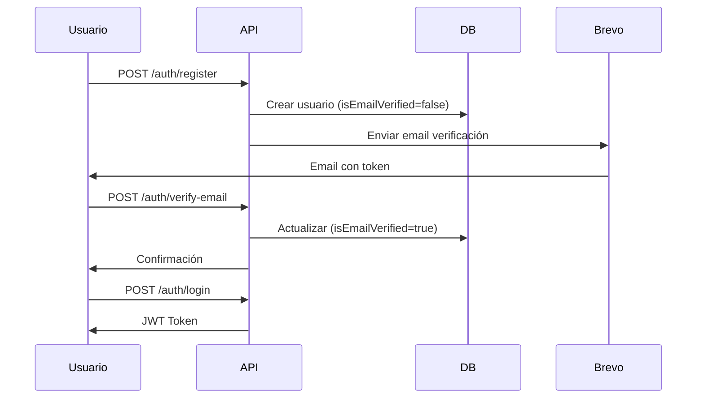
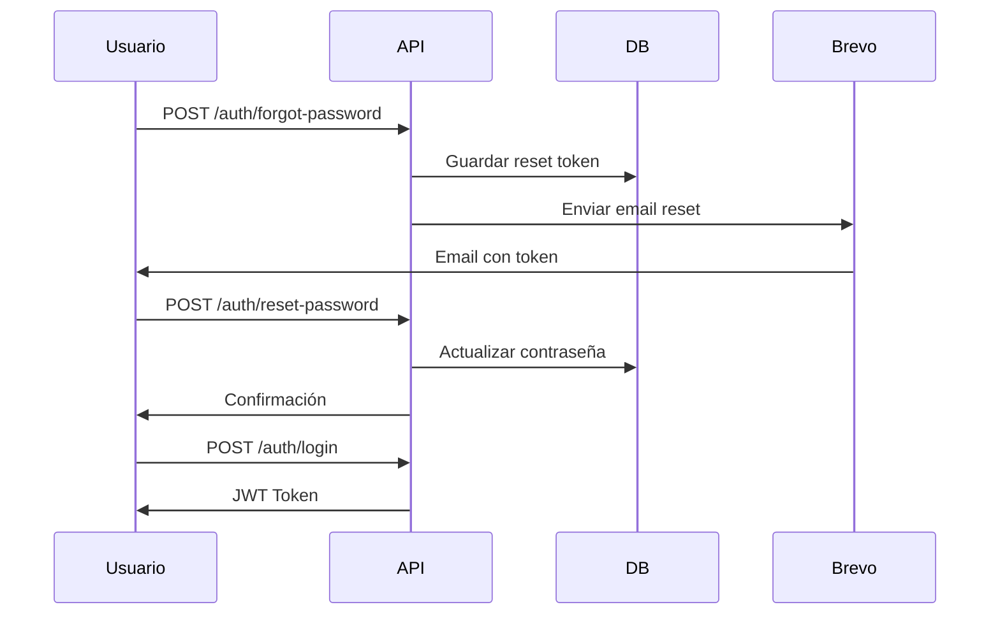

# Email Verification & Password Reset

## 📧 Características

El sistema implementa verificación de email y restablecimiento de contraseña usando Brevo (SendinBlue) como proveedor de email.

### ✅ Funcionalidades Implementadas

1. **Verificación de Email**
   - Envío automático al registrarse
   - Token válido por 24 horas
   - Límite de 2 correos por hora por email
   - No se puede iniciar sesión sin verificar

2. **Restablecimiento de Contraseña**
   - Solicitud con email
   - Token válido por 1 hora
   - Límite de 2 correos por hora por email
   - Validación de fortaleza de contraseña

## 🎨 Diseño de Emails

Los emails siguen el estilo elegante de Mery Garcia - Cosmetic Tattoo:

- **Colores**: Negro, blanco y rosa (#ffb6c1)
- **Tipografía**: Arial, espaciado amplio
- **Estilo**: Minimalista, profesional, femenino
- **Responsive**: Adaptados para móvil

## 🚀 Endpoints

### 1. Registro (POST /api/auth/register)

Registra un nuevo usuario y envía email de verificación.

**Request:**
```json
{
  "email": "user@example.com",
  "password": "Password123",
  "firstName": "María",
  "lastName": "García"
}
```

**Response:**
```json
{
  "success": true,
  "message": "Usuario registrado exitosamente. Por favor verifica tu correo electrónico.",
  "timestamp": "2024-01-01T00:00:00.000Z"
}
```

### 2. Verificar Email (POST /api/auth/verify-email)

Verifica el email del usuario con el token recibido.

**Request:**
```json
{
  "token": "abc123xyz..."
}
```

**Response:**
```json
{
  "success": true,
  "message": "Correo electrónico verificado exitosamente. Ya puedes iniciar sesión.",
  "timestamp": "2024-01-01T00:00:00.000Z"
}
```

### 3. Reenviar Verificación (POST /api/auth/resend-verification)

Reenvía el correo de verificación. Límite: 2 por hora.

**Request:**
```json
{
  "email": "user@example.com"
}
```

**Response:**
```json
{
  "success": true,
  "message": "Correo de verificación enviado exitosamente",
  "timestamp": "2024-01-01T00:00:00.000Z"
}
```

**Error (límite alcanzado):**
```json
{
  "success": false,
  "message": "Por favor espera 45 minutos antes de solicitar otro correo de verificación",
  "error": "Bad Request",
  "timestamp": "2024-01-01T00:00:00.000Z",
  "statusCode": 400
}
```

### 4. Iniciar Sesión (POST /api/auth/login)

Autentica al usuario. Requiere email verificado.

**Request:**
```json
{
  "email": "user@example.com",
  "password": "Password123"
}
```

**Response (email no verificado):**
```json
{
  "success": false,
  "message": "Por favor verifica tu correo electrónico antes de iniciar sesión",
  "error": "Unauthorized",
  "timestamp": "2024-01-01T00:00:00.000Z",
  "statusCode": 401
}
```

**Response (éxito):**
```json
{
  "success": true,
  "data": {
    "accessToken": "eyJhbGciOiJIUzI1NiIsInR5cCI6IkpXVCJ9...",
    "expiresIn": "24h",
    "role": "USER",
    "email": "user@example.com",
    "firstName": "María",
    "lastName": "García"
  },
  "timestamp": "2024-01-01T00:00:00.000Z"
}
```

### 5. Olvidé mi Contraseña (POST /api/auth/forgot-password)

Solicita un token para restablecer la contraseña. Límite: 2 por hora.

**Request:**
```json
{
  "email": "user@example.com"
}
```

**Response:**
```json
{
  "success": true,
  "message": "Si el correo existe, recibirás instrucciones para restablecer tu contraseña",
  "timestamp": "2024-01-01T00:00:00.000Z"
}
```

### 6. Restablecer Contraseña (POST /api/auth/reset-password)

Restablece la contraseña con el token recibido.

**Request:**
```json
{
  "token": "abc123xyz...",
  "newPassword": "NewPassword123"
}
```

**Response:**
```json
{
  "success": true,
  "message": "Contraseña restablecida exitosamente. Ya puedes iniciar sesión.",
  "timestamp": "2024-01-01T00:00:00.000Z"
}
```

## ⚙️ Configuración

### Variables de Entorno

Agregar al archivo `.env`:

```env
# Brevo (Email Service)
BREVO_API_KEY="your-brevo-api-key-here"
EMAIL_FROM="noreply@merygarcia.com"
FRONTEND_URL="http://localhost:3000"
```

### Obtener API Key de Brevo

1. Crear cuenta en [Brevo](https://www.brevo.com/)
2. Ir a **Settings** > **SMTP & API**
3. Crear nueva API Key
4. Copiar y pegar en `.env`

### Configurar Dominio de Email

Para usar un email personalizado (recomendado):

1. En Brevo: **Settings** > **Senders & IP**
2. Agregar y verificar dominio
3. Actualizar `EMAIL_FROM` en `.env`

## 🔒 Seguridad

### Rate Limiting

- **2 emails por hora** por dirección de email
- Aplica para verificación Y restablecimiento
- El límite se calcula desde el último envío

### Tokens

- **Verificación de email**: 24 horas de validez
- **Restablecimiento de contraseña**: 1 hora de validez
- Tokens de 64 caracteres hexadecimales
- Se eliminan al usarse

### Validación de Contraseña

Requisitos mínimos:
- 8 caracteres mínimo
- 1 letra mayúscula
- 1 letra minúscula
- 1 número
- Caracteres especiales permitidos: @$!%*?&

## 📊 Schema de Base de Datos

```prisma
model User {
  // ... otros campos
  
  // Email verification
  isEmailVerified    Boolean   @default(false)
  emailVerificationToken String?
  emailVerificationExpires DateTime?
  lastVerificationEmailSent DateTime?
  
  // Password reset
  passwordResetToken String?
  passwordResetExpires DateTime?
  lastPasswordResetEmailSent DateTime?
}
```

## 🧪 Testing

### 1. Registrar Usuario

```bash
curl -X POST http://localhost:3000/api/auth/register \
  -H "Content-Type: application/json" \
  -d '{
    "email": "test@example.com",
    "password": "Test1234",
    "firstName": "Test",
    "lastName": "User"
  }'
```

### 2. Verificar Email

Usar el token recibido por email:

```bash
curl -X POST http://localhost:3000/api/auth/verify-email \
  -H "Content-Type: application/json" \
  -d '{"token": "TOKEN_FROM_EMAIL"}'
```

### 3. Intentar Login

```bash
curl -X POST http://localhost:3000/api/auth/login \
  -H "Content-Type: application/json" \
  -d '{
    "email": "test@example.com",
    "password": "Test1234"
  }'
```

### 4. Reenviar Verificación

```bash
curl -X POST http://localhost:3000/api/auth/resend-verification \
  -H "Content-Type: application/json" \
  -d '{"email": "test@example.com"}'
```

### 5. Olvidé mi Contraseña

```bash
curl -X POST http://localhost:3000/api/auth/forgot-password \
  -H "Content-Type: application/json" \
  -d '{"email": "test@example.com"}'
```

### 6. Restablecer Contraseña

```bash
curl -X POST http://localhost:3000/api/auth/reset-password \
  -H "Content-Type: application/json" \
  -d '{
    "token": "TOKEN_FROM_EMAIL",
    "newPassword": "NewPass1234"
  }'
```

## 🐛 Troubleshooting

### Email no llega

1. **Verificar configuración de Brevo**
   - API Key válida
   - Dominio verificado
   - Límites de envío no alcanzados

2. **Revisar logs de la aplicación**
   ```bash
   pnpm run start:dev
   ```
   Buscar mensajes de `EmailService`

3. **Verificar bandeja de spam**

### Error "Por favor espera X minutos"

- Es el rate limiting funcionando correctamente
- Esperar el tiempo indicado
- O para testing, limpiar los campos de fecha en la base de datos

### Token inválido o expirado

1. **Verificación**: Válido por 24 horas
2. **Restablecimiento**: Válido por 1 hora
3. Solicitar un nuevo token si expiró

## 📝 Notas de Desarrollo

### Personalizar Templates

Los templates están en `src/modules/email/email.service.ts`:
- `getVerificationEmailTemplate()`
- `getPasswordResetEmailTemplate()`

### Modificar Rate Limits

En `src/modules/auth/auth.service.ts`, cambiar:
```typescript
const hourAgo = DateTimeUtil.now().minus({ hours: 1 }).toJSDate();
```

### Cambiar Validez de Tokens

**Verificación (24h):**
```typescript
const verificationExpires = DateTimeUtil.now().plus({ hours: 24 }).toJSDate();
```

**Restablecimiento (1h):**
```typescript
const resetExpires = DateTimeUtil.now().plus({ hours: 1 }).toJSDate();
```

## 🔄 Flujos Completos

### Flujo de Registro



### Flujo de Restablecimiento


